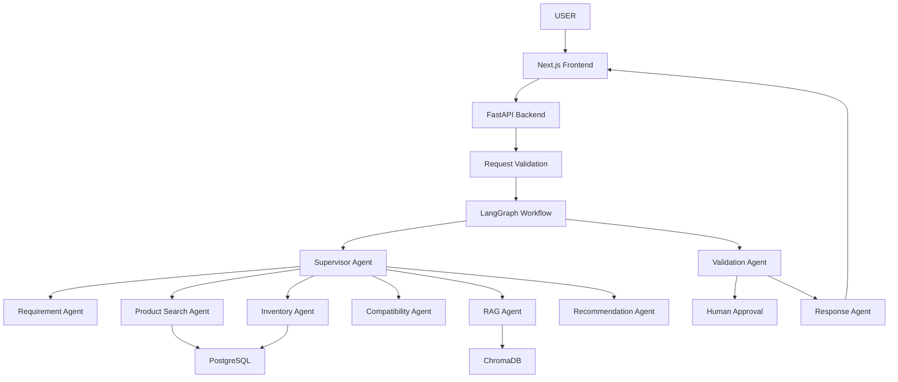

# Conversational Shopping Concierge

A production-style multi-agent e-commerce assistant built with FastAPI, LangChain, LangGraph, Next.js, ChromaDB, PostgreSQL, Redis, and OpenAI.

## Overview

This project demonstrates a real shopping concierge that can understand natural-language product requests, search product catalogs, verify inventory, assess compatibility, use RAG for product knowledge, recommend items, and pause for human approval before consequential actions.

## Architecture

## Features

- Multi-agent orchestration with LangGraph
- Specialized agents for requirements, search, inventory, compatibility, recommendation, action, validation, and response
- RAG with ChromaDB and OpenAI embeddings
- Structured product search and inventory checks
- Human approval workflow for purchase actions
- Typed workflow state and safe routing
- Dockerized deployment setup
- CI workflow in GitHub Actions

## Stack

- Frontend: Next.js, React, TypeScript, Tailwind CSS
- Backend: FastAPI, Pydantic, Python
- Agent framework: LangChain, LangGraph
- Vector DB: ChromaDB
- Database: PostgreSQL
- Cache: Redis
- AI: OpenAI API
- Testing: Pytest

## Running locally

1. Copy backend environment file:
   cp backend/.env.example backend/.env
2. Install backend dependencies:
   cd backend && python3.12 -m venv .venv && source .venv/bin/activate && pip install -r requirements.txt
3. Start backend:
   uvicorn app.main:app --reload
4. Install frontend dependencies:
   cd frontend && npm install
5. Start frontend:
   npm run dev
6. Optional Docker stack:
   cd .. && docker compose up --build

## API

The backend exposes endpoints such as:

- POST /api/chat
- POST /api/agent/run
- GET /api/health
- GET /api/workflows/{workflow_id}
- POST /api/approval/{workflow_id}

## Notes

This scaffold includes a working local implementation with mock product data and in-memory workflow orchestration that can later be connected to real PostgreSQL, Redis, OpenAI, and ChromaDB deployments.
