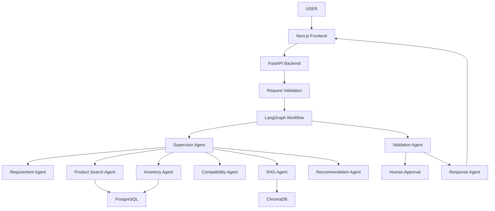

# Conversational Shopping Concierge

A full-stack shopping assistant with a Next.js storefront, a FastAPI product and chat API, and a LangGraph shopping workflow. The demo catalog is local, so browsing and product recommendations work without configuring an LLM API key.

## Overview

This project demonstrates a real shopping concierge that can understand natural-language product requests, search product catalogs, verify inventory, assess compatibility, use RAG for product knowledge, recommend items, and pause for human approval before consequential actions.

## Architecture



## Features

- Multi-agent orchestration with LangGraph
- Specialized agents for requirements, search, inventory, compatibility, recommendation, action, validation, and response
- RAG with ChromaDB and OpenAI embeddings
- Product catalog with detail pages and inventory information
- Conversational product search with requirement and inventory checks
- Browser-persisted cart for reviewing selected products
- Human approval workflow for purchase actions
- Typed workflow state and safe routing
- Dockerized deployment setup
- CI workflow in GitHub Actions

## Stack

- Frontend: Next.js, React, TypeScript, Tailwind CSS
- Backend: FastAPI, Pydantic, Python
- Agent framework: LangChain, LangGraph
- Vector DB: ChromaDB
- Database: PostgreSQL
- Cache: Redis
- AI: OpenAI API
- Testing: Pytest

## Running locally

Start the backend from the project directory:

```bash
cd backend
python3.12 -m venv .venv
source .venv/bin/activate
pip install -r requirements.txt
uvicorn app.main:app --reload
```

In another terminal, start the frontend:

```bash
cd frontend
npm install
npm run dev
```

Open [http://localhost:3000](http://localhost:3000). The frontend API routes proxy chat and catalog requests to `http://localhost:8000` by default. Set `API_URL` or `NEXT_PUBLIC_API_URL` if the backend runs elsewhere.

To run the backend tests:

```bash
cd backend
python -m pytest -q
```

Optional infrastructure services can be started with `docker compose up --build` from this directory. Copy `backend/.env.example` to `backend/.env` first if using the compose backend service.

## Vercel deployment

The production frontend is available at [frontend-topaz-xi-ce26ca02l0.vercel.app](https://frontend-topaz-xi-ce26ca02l0.vercel.app), and its FastAPI backend is deployed at [resumeproject-liard.vercel.app](https://resumeproject-liard.vercel.app). The frontend's production `API_URL` points to that backend.

Both are separate Vercel projects in this monorepo. The frontend project root is `frontend/`; the backend project root is `conversational-shopping-concierge/backend/`. The backend's `vercel.json` routes requests through the FastAPI app. After linking the appropriate Vercel project, deploy from the matching directory/project root with `vercel --prod`. Keep the frontend's production `API_URL` set to the public backend URL.

## API

The backend exposes:

- POST /api/chat
- POST /api/agent/run
- GET /api/health
- GET /api/products
- GET /api/workflows/{workflow_id}
- POST /api/approval/{workflow_id}

## Notes

This project uses sample product data and in-memory workflow orchestration. PostgreSQL, Redis, OpenAI, and ChromaDB integrations are optional infrastructure and are not required for the local catalog, cart, or demo chat flow.
